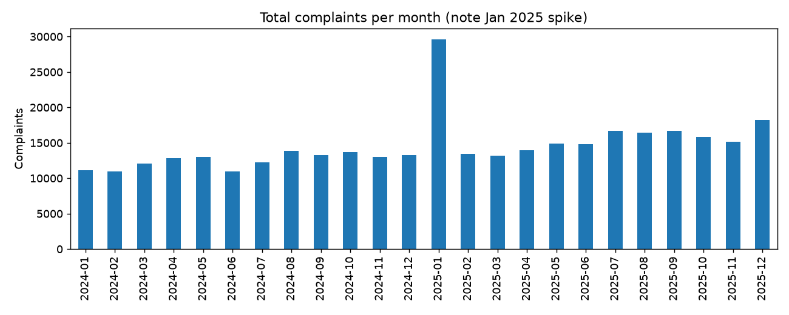
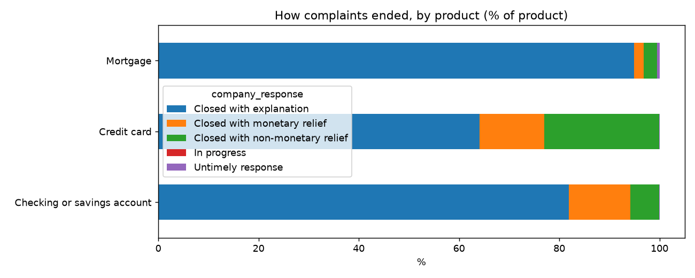
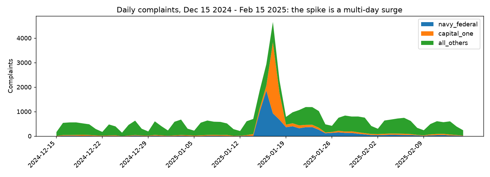
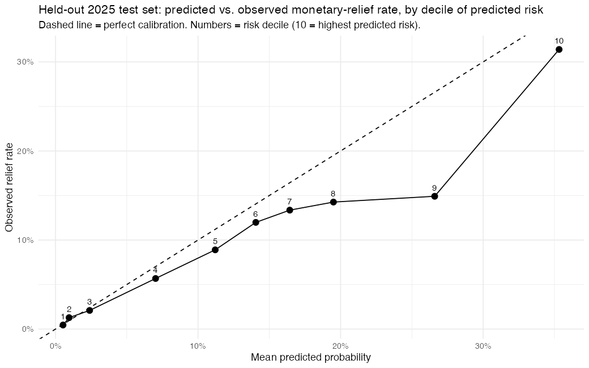
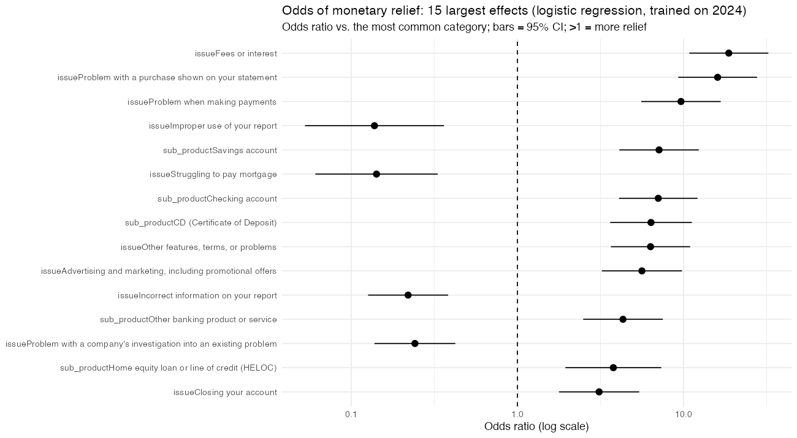

# CFPB Bank Complaints Analysis

SQL + Python analysis of public consumer complaints about **mortgages, credit cards, and checking/savings accounts** filed with the Consumer Financial Protection Bureau (CFPB) in 2024–2025.

**Questions:** How do complaint volumes move over time? Which companies and issues dominate? How often do companies respond on time, and how do complaints end?

## Data

- **Source:** CFPB Consumer Complaint Database, public search API
  `https://www.consumerfinance.gov/data-research/consumer-complaints/search/api/v1/`
- **Downloaded:** 2026-09-29 (`python -m src.download`)
- **Filters:** `date_received` 2024-01-01 to 2025-12-31; products `Mortgage`, `Credit card`, `Checking or savings account`
- **Size:** 349,119 complaints (matches the API's reported total for each product-month; the downloader fails if any chunk is short), 1,631 distinct companies
- The full database has ~8.2M complaints for 2024–2025, but ~88% are credit-reporting complaints, so I chose the products a retail bank sells.
- The raw CSV is not committed (100 MB); the downloader recreates it. The CFPB updates records over time, so a re-download later may differ slightly.

## Method

1. `src/download.py`: pulls the data one product-month at a time (the API caps a single export) and checks each chunk's row count.
2. `src/clean.py`: tested cleaning functions (date trimming to `YYYY-MM-DD`, state validation, Yes/No → 1/0, blanks → NULL).
3. `src/load.py` + `sql/00_schema.sql`: loads into SQLite; `complaint_id` is the primary key and `CHECK` constraints reject malformed dates.
4. `sql/01…13_*.sql`: the analysis queries (joins, GROUP BY/HAVING, CTEs, window functions `ROW_NUMBER`/`LAG`/`SUM() OVER`, date functions).
5. `src/analyze.py`: runs every query, writes `outputs/*.csv` and charts.
6. `src/export_model_data.py` + `r/`: exports the modeling table (SQL Q14) and fits the R models with tested helper functions (`r/test_helpers.R`).

## Findings (all numbers from the queries in `sql/`, results in `outputs/`)

**Volume.** 150,249 complaints in 2024 and 198,870 in 2025. Monthly totals sat between about 11,000 and 14,000 through 2024, then between about 13,000 and 18,000 in 2025 (Q1, Q6).

**A January 2025 spike.** 29,644 complaints in January 2025, up 123% from December 2024, then down 55% in February (Q6). It is concentrated in two companies: **Navy Federal Credit Union** received 7,638 that month (23.7× its average 2024 month) and **Capital One** 5,754 (7.6×) (Q8). I checked whether this is duplicates or a reporting artifact; see [Is the January 2025 spike real?](#is-the-january-2025-spike-real) below.



**Top companies by raw count** (Q2): JPMorgan Chase (28,234), Capital One (26,968), Wells Fargo (22,564), Citibank (21,791), Bank of America (20,233). These are raw counts, not per customer, so bigger banks naturally rank higher.

**Top issue** (Q3): "Managing an account" is the #1 issue for four of the five largest companies (Bank of America, Capital One, JPMorgan Chase, Wells Fargo). For Citibank the top issue is "Problem with a purchase shown on your statement" (5,192).

**Timely responses** (Q4): 98.67% for mortgages, 99.32% for checking/savings, 99.71% for credit cards.

**Outcomes** (Q5): most complaints close "with explanation": 94.9% of mortgage, 81.9% of checking/savings, 64.1% of credit-card complaints. Credit-card complaints end with monetary or non-monetary relief far more often (12.9% and 22.9%) than mortgage complaints (1.9% and 2.7%).



**Days to reach the company** (Q7): the CFPB forwards a complaint on average 0.99 (checking), 1.18 (credit card), and 2.39 (mortgage) days after receiving it.

## Is the January 2025 spike real?

I ran four checks (Q9–Q13) on the Navy Federal surge. All numbers below come from those queries.

| Check | Result |
|---|---|
| **Duplicate IDs** (Q9) | 0. `complaint_id` is unique across all 349,119 rows. |
| **Near-duplicates** (Q9, Q13): rows identical on every field except the ID (the data has no complaint text, so this is the strongest test available) | 1,906 of Navy's 7,638 January complaints (24.95%) have an identical twin, vs 2.56% of all other complaints. But 5,732 (75%) are unique, and twin groups are small: 575 pairs, 132 triples, and the largest group has 10 rows (two groups). A bulk duplicate upload would show a few huge groups. The complaints also come from 2,638 different (masked) ZIP codes. |
| **Spread over days?** (Q10, chart below) | Navy filed 11–16 a day on Jan 12–14, then **1,017 (Jan 15), 1,859 (Jan 16), 932, 674, 368, 406**, decaying to 77–157 a day over Jan 25–31. A multi-day surge that rises and decays, not one bulk date. |
| **Concentrated in one product / issue / channel?** (Q11) | Yes, and it is one story: 6,970 of the 7,638 (91%) are the issue "Problem caused by your funds being low" (93× its 2024 monthly average of 74.7), 7,411 are checking/savings, and 7,565 (99%) came via Web. It is spread across geography: 16 states have 100+ each, led by GA (1,086), TX (1,070), FL (855), VA (550), NC (507), SC (500). |
| **Dates consistent?** (Q12) | No complaint was sent to the company before it was received. Average days to reach the company was 0.10 in Jan 2025 vs 0.66 in other Navy months; the longest gap is 64 vs 63 days. Nothing odd. |



**Conclusion: it is a real surge of filed complaints, not duplicates and not a one-day bulk upload. Its cause for Navy Federal is unknown.**

- **Capital One's part of the spike matches a public event.** Capital One filed 2,904 complaints on Jan 17 (vs ~30 a day normally). Public reporting says a power loss and hardware failure at vendor FIS caused a several-day outage of Capital One and "more than two dozen banks" starting Jan 15 or 16 and ending Jan 19, 2025 (sources: [Payments Dive](https://www.paymentsdive.com/news/capital-one-outage-fis-bank-of-oklahoma-citi/737858/), [NBC News](https://www.nbcnews.com/business/business-news/capital-one-acknowledges-outage-users-report-issues-accessing-deposits-rcna187966)). The two articles differ by a day on the start date.
- **Navy Federal is not named in either article, and I found no source explaining its surge.** Its surge begins on the same day (Jan 15) and is dominated by a "funds being low" issue, which is *consistent with* a similar processing problem, but that is my guess, not a finding.
- **What "real" does and does not mean:** the filings are genuine, distinct records in the CFPB database. I cannot rule out that many were prompted by the same event or a coordinated push (99% came via Web), and the near-duplicate test cannot prove that no two records are the same complaint, only that there is no sign of bulk copying.

## Which complaints end in monetary relief? (R model)

**Question:** given what is known when a complaint is *filed*, can we predict whether it will end in "Closed with monetary relief"? (`sql/14_model_data.sql` builds the table, `r/model.R` fits it; results in `outputs/model_*`.)

**Outcome and base rate.** `relief = 1` if `company_response` is "Closed with monetary relief". 407 complaints whose outcome is not final ("In progress" 2, "Untimely response" 405) are dropped. The relief rate is **12.29% in 2024** (train, n = 150,139) and **10.43% in 2025** (test, n = 198,573). Mortgage complaints get relief far less often (1.92% overall) than credit-card or checking/savings complaints (about 12–13%).

**Features (all known at filing):** sub-product, issue, state, channel, tags (Older American / Servicemember), month, and a company-size proxy (log of the company's 2024 complaint count). Rare categories (< 200 training rows) are grouped as "Other". `product` is not a predictor because it is redundant given sub-product and issue (including it made the regression unstable).

**Left out on purpose, to avoid leakage** (using information that only exists *after* the outcome): `company_response` (it is the outcome), `company_public_response`, `timely_response` and `date_sent` (all set after the company responds), plus identifiers (`complaint_id`, company name, ZIP code). `tests/test_export.py` checks that none of these reach the model table.

**Split.** Trained on 2024, tested on 2025 (a time split, not random): real use is predicting future complaints from past ones, and a random split would let the model see the same weeks it is tested on. The probability cut-off (0.20) was chosen on the training data only (best F1), then applied unchanged to 2025.

**Results on the held-out 2025 set** (n = 198,573; 20,716 relief cases):

| Model | Accuracy | Precision | Recall | AUC |
|---|---|---|---|---|
| Baseline: always "no relief" | 89.57% | – | 0% | 0.500 |
| **Logistic regression** | 76.54% | 22.15% | 49.66% | **0.750** |
| Decision tree (rpart) | 81.65% | 24.46% | 36.33% | 0.652 |

Logistic regression confusion matrix (predicted rows, actual columns): 10,287 true positives, 36,153 false positives, 10,429 false negatives, 141,704 true negatives.

- **Accuracy is misleading here.** "Always no relief" is 89.57% accurate but finds none of the relief cases. At the chosen cut-off the model catches about half of the relief cases (recall 49.66%), and of the 46,440 complaints it flags, 22.15% really got relief, about 2.1× the 10.43% base rate. That is a useful ranking, not a reliable predictor: 78% of its flags are wrong.
- **AUC 0.750** means a random relief complaint gets a higher score than a random non-relief one 75% of the time (0.5 = coin flip). Train AUC was 0.787, so there is a small drop on new data. Excluding January 2025 (the surge above) gives 0.767. A rule using only the product gives 0.536, so the issue/sub-product details carry the signal. The tree (0.652) was worse than the logistic regression.
- **Calibration** (chart below): predictions track reality in the low deciles, and the top decile is close (predicted 35.3%, observed 31.4%), but the model **over-predicts in the middle-to-high deciles** (decile 9: predicted 26.6%, observed 14.9%). That is consistent with the relief rate falling from 12.29% to 10.43% between 2024 and 2025.



**Largest drivers** (odds ratios with 95% confidence intervals, `outputs/model_odds_ratios.csv`). An odds ratio above 1 means relief is more likely, below 1 less likely, compared with the most common category (issue "Managing an account", general-purpose credit card, Web, no tags), holding the other features fixed:

- Issue "Fees or interest": **18.7** (10.8–32.3). Issue "Problem with a purchase shown on your statement": **16.0** (9.3–27.6). In the raw training data, relief was 31.6% for purchase problems and 14.9% for "Managing an account".
- Issues about credit reports go the other way: "Improper use of your report" **0.14** (0.05–0.36), "Incorrect information on your report" **0.22** (0.13–0.38; raw relief rate 0.6%). "Struggling to pay mortgage": **0.14** (0.06–0.33).
- Checking account sub-product **7.0** (4.1–12.1) vs a general credit card.
- Smaller but tightly estimated: tag "Older American" **1.27** (1.20–1.34); referral channel **1.22** (1.14–1.30) and phone **0.90** (0.84–0.97) vs Web; each one-unit increase in log company size **1.16** (1.15–1.18).



**What this cannot say.** These are associations in one year of complaints, not causes: for example, fee and purchase disputes may end in refunds simply because a refund is the natural remedy, not because of anything about the consumer. Issue categories are entangled with sub-product, which is why some intervals are wide. Odds ratios are not probabilities.

## Limitations

- **Not a random sample.** These are only consumers who chose to complain. Findings describe complaints, not customer experience in general.
- **Volume is not harm.** Big companies have more customers. Without customer counts I cannot compute a complaint rate, so company rankings are not a ranking of quality.
- **Product labels are imperfect.** 43,936 rows (12.6%) belong to Equifax, TransUnion and Experian, which appear under these products (mostly "Credit card"). They are credit bureaus, not banks, so I left them in and flag them here rather than silently dropping them.
- **No dispute data.** The "Consumer disputed?" field was discontinued by the CFPB in 2017 and is not in this dataset, so no dispute-rate analysis.
- **Response time is not measured.** The dataset has only a timely/untimely flag and the date the CFPB sent the complaint to the company. Q7 measures the CFPB's forwarding time, not company response time.
- `timely_response = 0` is 2,031 rows while `company_response = 'Untimely response'` is 405; these are different fields and I did not reconcile them.
- 1,951 rows have no state (stored as NULL).
- **The model is a ranking aid, not a decision tool.** Precision is 22% at the chosen cut-off, and it over-predicts relief in the middle deciles on 2025 data. It has no complaint text and no customer information, only the fields listed above.
- **One time split (2024 → 2025), one year each.** I did not test other splits, so I cannot say how stable the numbers are. The Navy Federal/Capital One surge sits in the 2025 test set; results without January 2025 are similar (AUC 0.767).
- **The near-duplicate test has no complaint text to work with**, so it can show there is no sign of bulk copying but cannot prove that no two records describe the same complaint.

## Reproduce

```bash
python3 -m venv .venv && source .venv/bin/activate
pip install -r requirements.txt
python -m src.download      # ~10 min; rate-limited API
python -m pytest -q         # 13 tests
python -m src.load          # builds data/complaints.db
python -m src.analyze       # writes outputs/
python -m src.export_model_data   # writes data/model_data.csv (SQL Q14)
Rscript r/test_helpers.R       # R helper tests
Rscript r/model.R              # fits the R models, writes outputs/model_* and r_session_info.txt
sqlite3 data/complaints.db < sql/01_volume_by_product_month.sql   # or run any query directly
```

The R step needs R (built with 4.6.1) and the packages `readr`, `dplyr`, `ggplot2`, `rpart`; see `outputs/r_session_info.txt`.
